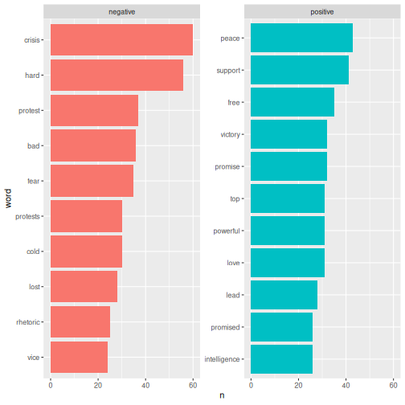
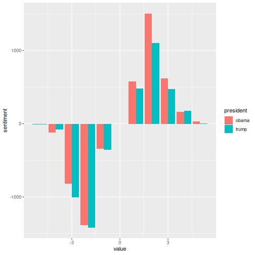
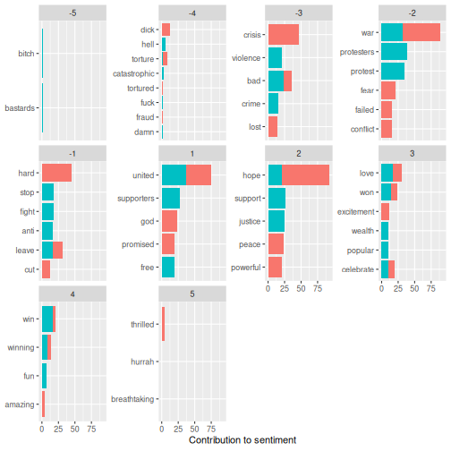

:::::::::::::::::::::::::::::::::::::: questions 

- What is a sentiment?
- How is sentiment analysis conducted?

::::::::::::::::::::::::::::::::::::::::::::::::

::::::::::::::::::::::::::::::::::::: objectives

- Learn about different lexicons
- Learn how to add sentiment to words using lexicons
- Analyse and visualise the sentiments in a text


::::::::::::::::::::::::::::::::::::::::::::::::


## Sentiment analysis

Sentiment refers to the emotion or tone in a text. It is typically categorised as positive, negative or neutral. Sentiment is often used to analyse opinions, attitudes or emotions in written content. In this case the written content is newspaper articles.

Sentiment analysis is a method used to identify and classify emotions in textual data. This is often done using word list (lexicons). The goal is to determine whether a given text has a positive, negative or neutral tone.

In order to do a sentiment analysis on our data we 
From the previous section we have a dataset containing a list of words in the text without stopwords. To do a sentiment analysis we can use a so-called lexicon and assign a sentiment to each word. In order to do this we need an list of words and their sentiment. A simple form would be wether they are positive or negative.

There are multiple sentiment lexicons. For a start we will be using the `bing` lexicon. This lexicon categorizes words as either positive or negative.


``` r
get_sentiments("bing")
```

``` output
# A tibble: 6,786 × 2
   word        sentiment
   <chr>       <chr>    
 1 2-faces     negative 
 2 abnormal    negative 
 3 abolish     negative 
 4 abominable  negative 
 5 abominably  negative 
 6 abominate   negative 
 7 abomination negative 
 8 abort       negative 
 9 aborted     negative 
10 aborts      negative 
# ℹ 6,776 more rows
```

In order to use the `bing`-lexicon, we have to save it.


``` r
bing <- get_sentiments("bing")
```

We now need to combine the sentiment to the words from our articles. We do this by performing an inner_join.


``` r
articles_bing <- articles_filtered |> 
  inner_join(bing)
```

``` output
Joining with `by = join_by(word)`
```

``` r
articles_bing
```

``` output
# A tibble: 6,159 × 6
      id president web_publication_date pillar_name word          sentiment
   <dbl> <chr>     <dttm>               <chr>       <chr>         <chr>    
 1     1 obama     2009-01-20 19:16:38  News        promises      positive 
 2     1 obama     2009-01-20 19:16:38  News        promise       positive 
 3     1 obama     2009-01-20 19:16:38  News        dust          negative 
 4     1 obama     2009-01-20 19:16:38  News        cold          negative 
 5     1 obama     2009-01-20 19:16:38  News        dawn          positive 
 6     1 obama     2009-01-20 19:16:38  News        celebrate     positive 
 7     1 obama     2009-01-20 19:16:38  News        inspirational positive 
 8     1 obama     2009-01-20 19:16:38  News        failed        negative 
 9     1 obama     2009-01-20 19:16:38  News        resound       positive 
10     1 obama     2009-01-20 19:16:38  News        attacks       negative 
# ℹ 6,149 more rows
```

In R, `inner_join()` is commonly used to combine datasets based on a shared column. In this case it is the `word` column. `inner_join()` matches words from a text dataset, in this case `articles_filtered` with words in the Bing sentiment lexicon to determine whether they are positive or negative.

When we have the combined dataset we can begin making a sentiment analysis. A start could be to count the number of positive and negative words used in articles, per president.


``` r
articles_bing |> 
  group_by(president) |> 
  summarise(positive = sum(sentiment == "positive"),
            negative = sum(sentiment == "negative"),
            difference = positive - negative) 
```

``` output
# A tibble: 2 × 4
  president positive negative difference
  <chr>        <int>    <int>      <int>
1 obama         1499     1800       -301
2 trump         1160     1700       -540
```
This shows that more positive than negative words are associated with both presidents. It also shows that Trump is the president with the highest number of associated negative words.

Another interesting thing to look at would the 10 most positive and negative words used in the articles.


``` r
articles_bing |> 
  count(word, sentiment, sort = TRUE) |> 
  ungroup() |> 
  group_by(sentiment) |> 
  slice_max(n, n = 10) |> 
  ungroup() |> 
  mutate(word = reorder(word, n)) |> 
  ggplot(mapping = aes(n, word, fill = sentiment)) +
  geom_col(show.legend = FALSE) +
  facet_wrap(~sentiment, scales = "free_y")
```


Here we can see the positive and negative words used in the articles.

With ´bing´ we only look at the sentiment in a binary fashion - a word is either positive or negative. If we try to do a similar analysis with AFINN, it looks different.


``` r
install.packages("textdata")
library(textdata)
```


``` r
library(textdata)
```


``` r
afinn <- get_sentiments("afinn")
```


:::: instructor
Bemærk at vi ikke på github kan downloade afinn. Derfor 
har vi downloaded afinn datasættet til en csv-fil pr 21. november 2025.
Med andre ord er der risiko for at siden kører med et uopdateret
datasæt.
::::


``` r
articles_afinn <- articles_filtered |> 
  inner_join(afinn) 
```

``` output
Joining with `by = join_by(word)`
```


``` r
articles_afinn |> 
  group_by(president) |> 
  summarise(sentiment = sum(value))
```

``` output
# A tibble: 2 × 2
  president sentiment
  <chr>         <dbl>
1 obama           224
2 trump          -632
```


``` r
articles_afinn |> 
  group_by(president, value) |> 
  summarise(sentiment = sum(value)) |> 
  ungroup() |>
  ggplot(mapping = aes(x = value, y = sentiment, fill = president)) +
  geom_col(position = "dodge")
```

``` output
`summarise()` has grouped output by 'president'. You can override using the
`.groups` argument.
```




``` r
articles_afinn |> 
  count(president, word, value, sort = TRUE) |> 
  ungroup() |> 
  group_by(president, value) |> 
  slice_max(n, n = 3) |> 
  ungroup() |> 
  mutate(word = reorder(word, n)) |> 
  ggplot(mapping = aes(n, word, fill = president)) +
  geom_col(show.legend = FALSE) +
  facet_wrap(~value, scales = "free_y") +
  labs(x = "Contribution to sentiment", 
       y = NULL)
```




::::::::::::::::::::::::::::::::::::: keypoints 

- Sentiments is the emotion or tone in a text
- There are different lexicons
- It is possible to add sentiments to words
- It is possible to visualise the sentiments

::::::::::::::::::::::::::::::::::::::::::::::::
