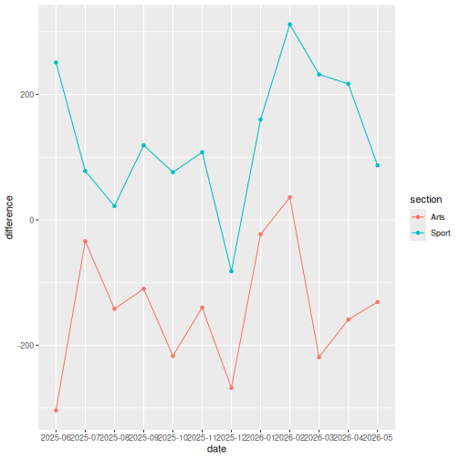
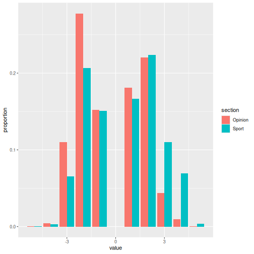

:::::::::::::::::::::::::::::::::::::: questions 

- What is a sentiment?
- How is sentiment analysis conducted?

::::::::::::::::::::::::::::::::::::::::::::::::

::::::::::::::::::::::::::::::::::::: objectives

- Learn about different lexicons
- Learn how to add sentiment to words using lexicons
- Analyse and visualise the sentiments in a text


::::::::::::::::::::::::::::::::::::::::::::::::


## Sentiment analysis

Sentiment refers to the emotion or tone in a text. It is typically categorised as positive, negative or neutral. Sentiment is often used to analyse opinions, attitudes or emotions in written content. In this case the written content is newspaper articles.

Sentiment analysis is a method used to identify and classify emotions in textual data. This is often done using word list (lexicons). The goal is to determine whether a given text has a positive, negative or neutral tone.

In order to do a sentiment analysis on our data we 
From the previous section we have a dataset containing a list of words in the text without stopwords. To do a sentiment analysis we can use a so-called lexicon and assign a sentiment to each word. In order to do this we need an list of words and their sentiment. A simple form would be wether they are positive or negative.

There are multiple sentiment lexicons. For a start we will be using the `bing` lexicon. This lexicon categorizes words as either positive or negative.


``` r
get_sentiments("bing")
```

``` output
# A tibble: 6,786 × 2
   word        sentiment
   <chr>       <chr>    
 1 2-faces     negative 
 2 abnormal    negative 
 3 abolish     negative 
 4 abominable  negative 
 5 abominably  negative 
 6 abominate   negative 
 7 abomination negative 
 8 abort       negative 
 9 aborted     negative 
10 aborts      negative 
# ℹ 6,776 more rows
```

In order to use the `bing`-lexicon, we have to save it.


``` r
bing <- get_sentiments("bing")
```

We now need to combine the sentiment to the words from our articles. We do this by performing an inner_join.


``` r
articles_bing <- articles_filtered |> 
  inner_join(bing)
```

``` output
Joining with `by = join_by(word)`
```

``` r
articles_bing
```

``` output
# A tibble: 123,667 × 8
      id date    section region author                 wordcount word  sentiment
   <dbl> <chr>   <chr>   <chr>  <chr>                      <dbl> <chr> <chr>    
 1     1 2026-05 News    UK     Jessica Murray and Ro…      1328 warn… negative 
 2     1 2026-05 News    UK     Jessica Murray and Ro…      1328 over… negative 
 3     1 2026-05 News    UK     Jessica Murray and Ro…      1328 lagg… negative 
 4     1 2026-05 News    UK     Jessica Murray and Ro…      1328 rapid positive 
 5     1 2026-05 News    UK     Jessica Murray and Ro…      1328 slow  negative 
 6     1 2026-05 News    UK     Jessica Murray and Ro…      1328 warn… negative 
 7     1 2026-05 News    UK     Jessica Murray and Ro…      1328 effe… positive 
 8     1 2026-05 News    UK     Jessica Murray and Ro…      1328 misu… negative 
 9     1 2026-05 News    UK     Jessica Murray and Ro…      1328 over… negative 
10     1 2026-05 News    UK     Jessica Murray and Ro…      1328 brea… positive 
# ℹ 123,657 more rows
```

In R, `inner_join()` is commonly used to combine datasets based on a shared column. In this case it is the `word` column. `inner_join()` matches words from a text dataset, in this case `articles_filtered` with words in the Bing sentiment lexicon to determine whether they are positive or negative.

When we have the combined dataset we can begin making a sentiment analysis. A start could be to count the number of positive and negative words used in articles, per president.


``` r
articles_bing |> 
  group_by(section) |> 
  summarise(positive = sum(sentiment == "positive"),
            negative = sum(sentiment == "negative"),
            difference = positive - negative) 
```

``` output
# A tibble: 5 × 4
  section   positive negative difference
  <chr>        <int>    <int>      <int>
1 Arts         11844    13555      -1711
2 Lifestyle    18337    13504       4833
3 News         11216    14220      -3004
4 Opinion       8452    11419      -2967
5 Sport        11350     9770       1580
```

This shows that more positive than negative words are associated with both presidents. It also shows that Trump is the president with the highest number of associated negative words.


``` r
articles_bing |> 
  group_by(section, date) |> 
  summarise(positive = sum(sentiment == "positive"),
            negative = sum(sentiment == "negative"),
            difference = positive - negative) |> 
  #ungroup() |> 
  filter(section %in% c("Arts", "Sport")) |> 
  ggplot(mapping = aes(x = date, y = difference, colour = section, group = section)) +
  geom_point() +
  geom_line()
```

``` output
`summarise()` has regrouped the output.
ℹ Summaries were computed grouped by section and date.
ℹ Output is grouped by section.
ℹ Use `summarise(.groups = "drop_last")` to silence this message.
ℹ Use `summarise(.by = c(section, date))` for per-operation grouping
  (`?dplyr::dplyr_by`) instead.
```



Looking at the graphs we can see that the wording in december in sports articles are quite negative compared to february. If we had a data set covering more years it would be interesting to see if this was a normal thing. For now it might be interesting to read the articles from december and februar and compare what they are writing about. So how do we get the articles


``` r
interesting_articles <- articles |> 
  filter(section == "Sport") |> 
  filter(date %in% c("2025-12", "2026-02"))
```


``` r
write_csv(interesting_articles, "data_out/interesting_articles.csv")
```


<!-- Another interesting thing to look at would the 10 most positive and negative words used in the articles. -->

<!-- ```{r facet_wrap} -->
<!-- # articles_bing |> 
  # count(word, sentiment, sort = TRUE) |> 
  # ungroup() |> 
  # group_by(sentiment) |> 
  # slice_max(n, n = 10) |> 
  # ungroup() |> 
  # mutate(word = reorder(word, n)) |> 
  # ggplot(mapping = aes(n, word, fill = sentiment)) +
  # geom_col(show.legend = FALSE) +
  # facet_wrap(~sentiment, scales = "free_y") -->

<!-- ``` -->

<!-- Here we can see the positive and negative words used in the articles. -->

With `bing` we only look at the sentiment in a binary fashion - a word is either positive or negative. If we try to do a similar analysis 
with `AFINN`, it looks different. `AFINN` is a sentiment lexicon. It consists of a list of words that are assigned sentiment scores ranging from -5 (very negative) to +5 (very positive).

`AFINN` is part of the package `textdata`, so we need to install the package and run library in order to be able to use it in this script.


``` r
install.packages("textdata")
library(textdata)
```

In order to use the `AFINN`-lexicon, we have to save it.


``` r
afinn <- get_sentiments("afinn")
```

``` output
Do you want to download:
 Name: AFINN-111 
 URL: http://www2.imm.dtu.dk/pubdb/views/publication_details.php?id=6010 
 License: Open Database License (ODbL) v1.0 
 Size: 78 KB (cleaned 59 KB) 
 Download mechanism: https 
```

``` error
Error in `menu()`:
! menu() cannot be used non-interactively
```

Let's have a look at it.


``` r
afinn
```

``` output
# A tibble: 2,477 × 2
   word       value
   <chr>      <dbl>
 1 abandon       -2
 2 abandoned     -2
 3 abandons      -2
 4 abducted      -2
 5 abduction     -2
 6 abductions    -2
 7 abhor         -3
 8 abhorred      -3
 9 abhorrent     -3
10 abhors        -3
# ℹ 2,467 more rows
```


:::: instructor
Bemærk at vi ikke på github kan downloade afinn. Derfor 
har vi downloaded afinn datasættet til en csv-fil pr 21. november 2025.
Med andre ord er der risiko for at siden kører med et uopdateret
datasæt. - TROR IKKE VI BEHØVER DET MERE - SNAK MED CHRISTIAN
::::
We now need to combine the sentiment to the words from our articles. We do this by performing an inner_join.


``` r
articles_afinn <- articles_filtered |> 
  inner_join(afinn) 
```

``` output
Joining with `by = join_by(word)`
```

Since the `AFINN` lexicon adds negative and positive numbers to the words (instead of strings as Bing does) we can easily calculate the difference as we did with `bing`. In order to see wether a section is dominated by positive or negative words.


``` r
articles_afinn |> 
  group_by(section) |> 
  summarise(different = sum(value))
```

``` output
# A tibble: 5 × 2
  section   different
  <chr>         <dbl>
1 Arts            730
2 Lifestyle     11230
3 News          -5744
4 Opinion       -4335
5 Sport          8045
```

It could be interesting to see how the different levels of negative and positive words are used in the different sections. 


``` r
articles_afinn |> 
  #group_by(section) |> 
  count(section, value) |> 
  pivot_wider(names_from = value, values_from = n)
```

``` output
# A tibble: 5 × 11
  section    `-5`  `-4`  `-3`  `-2`  `-1`   `1`   `2`   `3`   `4`   `5`
  <chr>     <int> <int> <int> <int> <int> <int> <int> <int> <int> <int>
1 Arts         14   203  2122  4807  2718  3189  4287  2037   574    28
2 Lifestyle     3   130  1444  4139  3560  5126  6468  2683   416    32
3 News          1    94  2283  6081  3860  4917  4922   699   155     6
4 Opinion       7    72  1802  4549  2496  2963  3610   721   153     6
5 Sport         9    52  1123  3563  2598  2871  3859  1894  1195    68
```


``` r
articles_afinn |> 
  count(section, value) |> 
  group_by(section) |>
  mutate(proportion = n / sum(n)) |> 
  ungroup() |> 
  select(-n) |> 
  arrange(desc(proportion)) |> 
  pivot_wider(names_from = value, values_from = proportion)
```

``` output
# A tibble: 5 × 11
  section   `-2`   `2`   `1`  `-1`    `3`   `-3`     `4`    `-4`     `5`    `-5`
  <chr>    <dbl> <dbl> <dbl> <dbl>  <dbl>  <dbl>   <dbl>   <dbl>   <dbl>   <dbl>
1 Opinion  0.278 0.220 0.181 0.152 0.0440 0.110  0.00934 0.00440 3.66e-4 4.27e-4
2 Lifesty… 0.172 0.269 0.214 0.148 0.112  0.0602 0.0173  0.00542 1.33e-3 1.25e-4
3 News     0.264 0.214 0.214 0.168 0.0304 0.0992 0.00673 0.00408 2.61e-4 4.34e-5
4 Arts     0.241 0.215 0.160 0.136 0.102  0.106  0.0287  0.0102  1.40e-3 7.01e-4
5 Sport    0.207 0.224 0.167 0.151 0.110  0.0652 0.0693  0.00302 3.95e-3 5.22e-4
```


``` r
articles_afinn |> 
  count(section, value) |> 
  group_by(section) |>
  mutate(proportion = n / sum(n)) |> 
  ungroup() |> 
  select(-n) |> 
  filter(section %in% c("Sport", "Opinion"))  |> 
  ggplot(mapping = aes(x = value, y = proportion, fill = section)) +
  geom_col(position = "dodge")
```



<!-- ```{r afinn_president_value_geom_col} -->
<!-- articles_afinn |> 
  filter(section %in% c("News", "Sport")) |> 
  group_by(section, value) |> 
  summarise(sentiment = sum(value)) |> 
  ungroup() |>
  ggplot(mapping = aes(x = value, y = sentiment, fill = section)) +
  geom_col(position = "dodge") -->

<!-- ``` -->


<!-- ```{r articles_afinn_ggplot_word_president} -->
<!-- articles_afinn |> 
  count(section, word, value, sort = TRUE) |> 
  ungroup() |> 
  group_by(section, value) |> 
  slice_max(n, n = 3) |> 
  ungroup() |> 
  mutate(word = reorder(word, n)) |> 
  ggplot(mapping = aes(n, word, fill = section)) +
  geom_col(show.legend = FALSE) +
  facet_wrap(~value, scales = "free_y") +
  labs(x = "Contribution to sentiment", 
       y = NULL) -->
<!-- ``` -->

<!-- So far we have created sentiment analysis looking at words as individual units, and not considered how they are related to the other words in a sentence. However what happens if a word that is concidered positive is negated by the word in front eg. "do not love"? We only catch it as positive. It is possible to make analysis where you look a more than one word. -->


::::::::::::::::::::::::::::::::::::: keypoints 

- Sentiments is the emotion or tone in a text
- There are different lexicons
- It is possible to add sentiments to words
- It is possible to visualise the sentiments

::::::::::::::::::::::::::::::::::::::::::::::::
